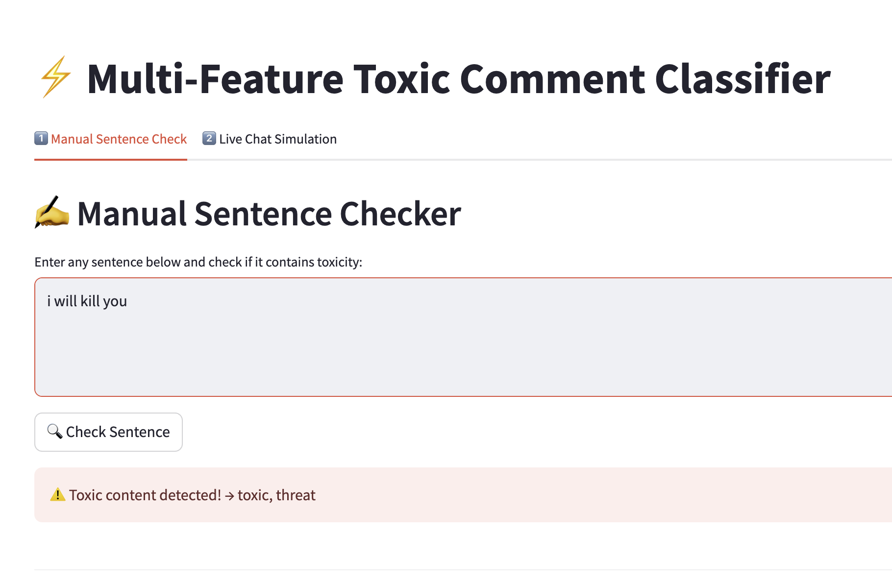
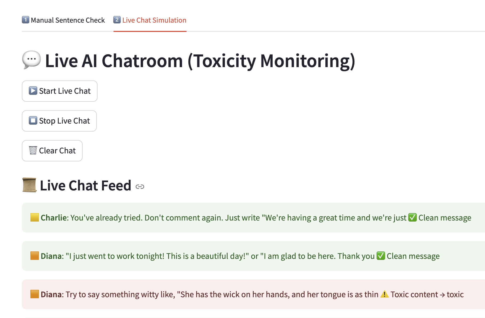

# ⚡ Multi-Feature Toxic Comment Classifier


A **real-time AI-powered social media comment simulator** that classifies comments into multiple toxicity categories and allows live interaction. Built using **Streamlit**, **HuggingFace Transformers**, **Scikit-Learn**, and **LSTM**.

---

## 🔹 Features
---

## 🔹 Demo Screenshot




## Live URL
Check out the live app hosted on **Streamlit Cloud**:  
[https://toxic-comment-ai-xgm4dfeau65bjr7kgixktw.streamlit.app/](https://toxic-comment-ai-xgm4dfeau65bjr7kgixktw.streamlit.app/)


## 🔹 Demo Video

You can watch the demo video here:  
[🎥 Demo Video](./screenshots/Demo.mov)

---


- **Manual Sentence Checker:**  
  Enter any text and detect toxicity across multiple categories:
  - `toxic`
  - `severe_toxic`
  - `obscene`
  - `threat`
  - `insult`
  - `identity_hate`

- **Live AI Chat Simulation:**  
  - Multiple AI personas posting realistic social media comments (4–6 words).  
  - Detect toxic content in real-time.  
  - Users can also participate by typing their own messages.

- **Customizable Toxicity Levels:**  
  Adjust the intensity of toxic comments using a slider (optional implementation).

- **AI Comment Generation:**  
  Short, realistic, social-media style comments generated per toxicity type using **GPT-2 / GPT-Neo**.

- **Real-Time Monitoring:**  
  Messages update dynamically and highlight toxic content for easy visualization.

---

## 🔹 Technology Stack

- **Python 3.12+**
- **Streamlit** – Interactive web app interface
- **Scikit-Learn** – Multi-label toxicity classification
- **Joblib** – Save and load ML models
- **HuggingFace Transformers** – AI-generated text
- **GPT-2 / GPT-Neo** – Short realistic comment generation
- **TensorFlow / Keras** – LSTM model for multi-label classification

---

## 🔹 Installation

1. **Clone the repository:**

```bash
git clone https://github.com/arpanneupane75/toxic-comment-ai.git
cd toxic-comment-ai
```

2. **Create a virtual environment:**

```bash
python -m venv venv
source venv/bin/activate   # macOS/Linux
venv\Scripts\activate      # Windows
```

3. **Install dependencies:**

```bash
pip install -r requirements.txt
```

4. **Download ML Models (if not included):**  
   - `best_model_Logistic Regression.pkl`  
   - `best_model_LSTM.h5`  
   - `tfidf_vectorizer.pkl`  
   - `keras_tokenizer.pkl`  
   Place them in the `/models` directory (or adjust `MODEL_PATH` & `VECTORIZER_PATH` in `app.py`).

---

## 🔹 Usage

```bash
streamlit run app.py
```

- **Manual Check:** Enter text and click **"Check Sentence"** to see toxicity predictions.  
- **Live Chat Simulation:**  
  - Click **"Start Live Chat"** to begin simulated conversation.  
  - Use **"Stop Live Chat"** to pause.  
  - Use **"Clear Chat"** to reset conversation.  
  - Optionally type your own messages to participate in the chat.

---

## 🔹 Model Comparison on 50k Subset

| Model                 | ROC-AUC  | Accuracy | Precision | Recall  | F1     | Train Time (s) |
|-----------------------|----------|---------|-----------|--------|--------|----------------|
| Logistic Regression    | 0.9547  | 0.764   | 0.775     | 0.456  | 0.554  | 6.85           |
| LightGBM               | 0.9471  | 0.948   | 0.734     | 0.469  | 0.547  | 146.47         |
| Decision Tree          | 0.7146  | 0.732   | 0.646     | 0.466  | 0.538  | 32.06          |
| Gradient Boosting       | 0.9155  | 0.745   | 0.670     | 0.415  | 0.508  | 549.11         |
| Random Forest          | 0.9435  | 0.763   | 0.771     | 0.413  | 0.488  | 1011.32        |
| Extra Trees            | 0.9356  | 0.760   | 0.691     | 0.419  | 0.487  | 1642.98        |
| AdaBoost               | 0.8905  | 0.716   | 0.767     | 0.264  | 0.383  | 258.84         |
| Naive Bayes            | 0.8930  | 0.740   | 0.599     | 0.294  | 0.362  | 0.32           |
| KNN                    | 0.6499  | 0.654   | 0.677     | 0.136  | 0.217  | 48.21          |
| Ridge Classifier        | 0.9397  | 0.678   | 0.652     | 0.055  | 0.099  | 1.76           |
| SGD Classifier         | 0.9420  | 0.674   | 0.470     | 0.040  | 0.072  | 0.63           |
| Linear SVC             | 0.9376  | 0.675   | 0.456     | 0.040  | 0.071  | 3.51           |

---

## 🔹 LSTM Model for Multi-Label Classification

- **Architecture:**  
  - Embedding layer  
  - Bidirectional LSTM (64 units)  
  - Dropout (0.3)  
  - Dense output layer with **sigmoid activation**

- **Training:**  
  - Loss: Binary Crossentropy  
  - Optimizer: Adam  
  - Early stopping based on validation loss  

- **Saved Model:** `best_model_LSTM.h5`

---

## 🔹 Sample Predictions

**Logistic Regression Predictions:**

| Text                              | Predicted Labels                  |
|----------------------------------|----------------------------------|
| You are an idiot and I hate you!  | toxic, obscene, insult           |
| Have a nice day my friend!        | clean                            |
| I will kill you tonight           | toxic, threat                     |
| This is a beautiful day son of bitch | toxic, obscene, insult        |
| Thank you for your help disgusting | clean                            |

**LightGBM Predictions:**

| Text                              | Predicted Labels                  |
|----------------------------------|----------------------------------|
| You are an idiot and I hate you!  | toxic, insult                     |
| Have a nice day my friend!        | clean                            |
| I will kill you tonight           | toxic                             |
| This is a beautiful day son of bitch | toxic, obscene, insult        |
| Thank you for your help disgusting | clean                            |

**Decision Tree Predictions:**

| Text                              | Predicted Labels                  |
|----------------------------------|----------------------------------|
| You are an idiot and I hate you!  | toxic, insult                     |
| Have a nice day my friend!        | clean                            |
| I will kill you tonight           | toxic                             |
| This is a beautiful day son of bitch | toxic, obscene, insult        |
| Thank you for your help disgusting | clean                            |

---

## 🔹 Future Enhancements

- Add **toxicity intensity slider** for custom AI comment generation  
- Add **multi-language support** for AI comments  
- Deploy to **Heroku / Streamlit Cloud** for online access  
- Include **user authentication** for personalized sessions  

---

## 🔹 Contributing

Contributions are welcome! Please follow these steps:

1. Fork the repository  
2. Create a new branch: `git checkout -b feature-name`  
3. Make your changes  
4. Commit your changes: `git commit -m "Add feature"`  
5. Push to the branch: `git push origin feature-name`  
6. Open a Pull Request

---

## 🔹 License

MIT License © 2025 [Arpan Neupane](mailto:arpanneupane75@gmail.com)

---

## 🔹 Contact

- **Email:** arpanneupane75@gmail.com  
- **Phone:** +977-9869540374  


---

*Made with ❤️ using Streamlit, HuggingFace, Scikit-Learn, and Keras*
# toxic-comment-ai
